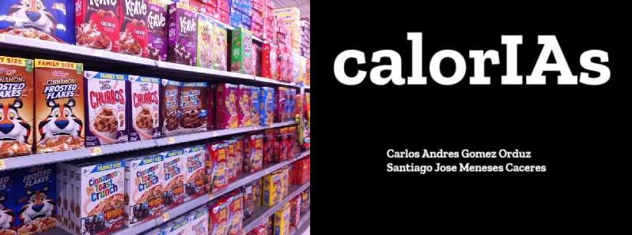

# calorIAs

# Autores
Carlos Andres Gomez Orduz, Santiago Jose Meneses Caceres.

# Objetivo
Predecir de manera correcta el rating de un grupo de cereales determinados.

# Conjunto de datos
El dataset empleado para este provee informacion de distintas marcas y tipos de cereal, junto con sus macro y micronutrientes respectivos, asi como otros factores relevantes.
Se puede acceder a este mediante el siguiente enlace: https://www.kaggle.com/datasets/crawford/80-cereals

# Modelos
- Gaussian Naive Bayes.
- Decision Tree Regressor.
- Support Vector Machine(SVR).
- Random Forest Regressor.

# Enlaces:
Código: https://colab.research.google.com/drive/1Yabh4w1MAHypUb0yoWexXMjn39Jp6Gos?usp=sharing

Video: 

Repositorio: 
